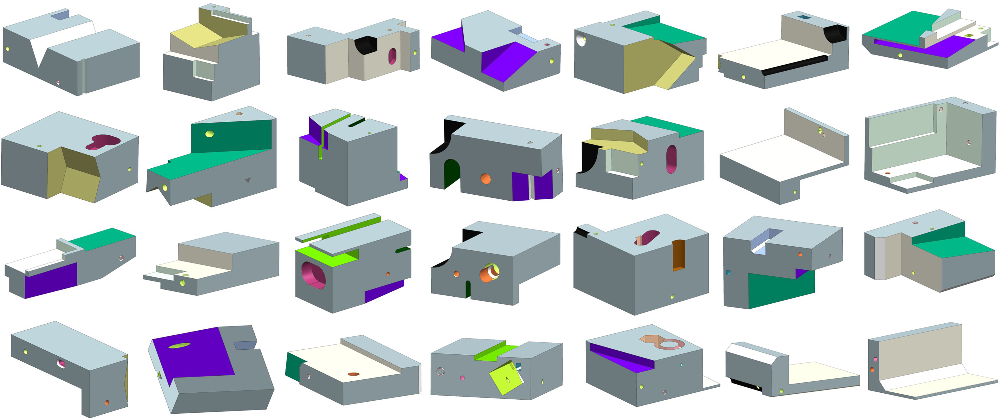

# MFCAD++ Dataset Generation
This repo contains the scripts used to generate the MFCAD++ dataset for the [Hierarchical CADNet](https://www.sciencedirect.com/science/article/abs/pii/S0010448522000240) paper.

The MFCAD++ dataset can be downloaded from here: https://pure.qub.ac.uk/en/datasets/mfcad-dataset-dataset-for-paper-hierarchical-cadnet-learning-from

Unlike the MFCAD dataset which used Pickled Python lists saved as .face_truth files, the MFCAD++ dataset saved the class labels directly to the ADVANCED_FACES in the STEP files.

<div align="center">
  
</div>

## Requirements
See the environment.yml file.

## Instructions
- To generate a dataset of CAD models with different machining features run **main.py**.
- In **main.py**, ```num_features``` parameter changes the number of feature classes to create feature sequences from.
- In **main.py**, ```combo_range``` parameter changes the min and max number of machining features in the feature sequences.
- In **main.py**, ```num_samples``` parameter changes the number of CAD models generated.
- You can change general parameters of the CAD models by changing values in **Utils/parameters.py**.

(It was found that the fillet/round tool in PythonOCC is not very robust and may cause Python to crash.)

## Benchmarks
| Network | Accuracy (%) | # Parameters |
| -------------------------------- | --------- | --------- |
| Hierarchical CADNet (Edge) | 97.37 | 9.76M |
| Hierarchical CADNet (Adj) | 96.52 | 6.62M |
| PointNet++ <sup>[1]</sup> | 85.88 | 1.42M |
| DGCNN <sup>[2]</sup> | 85.98 | 0.53M |
| BrepMFR <sup>[3]</sup> | **99.76** <sup>[3]</sup>  | - |
| AAGNet <sup>[4]</sup> | 99.57 <sup>[3]</sup> | **0.38M** |
| UV-Net <sup>[5]</sup> | 99.49 <sup>[3]</sup>  | - |
| BRepNet <sup>[6]</sup> | 99.43 <sup>[3]</sup>  | - |
| Modified PointNet++ <sup>[7]</sup> | 97.79 ± 0.05 | - |

## References
[1] Qian G., Li Y., Peng H., Mai J., Hammoud HAAK, Elhoseiny M., et al. PointNeXt: Revisiting PointNet++ with improved training and scaling strategies. In: Advances
in neural information processing systems. 2022, p. 23192–204.

[2] Wang Y., Sun Y., Liu Z., Sarma S.E., Bronstein M.M., Solomon J.M., Dynamic graph CNN for learning on point clouds, ACM Trans Graph, 38 (2018), Article 146

[3] Zhang S., Guan Z., Jiang H., Wang X., Tan P., BrepMFR: Enhancing machining feature recognition in B-rep models through deep learning and domain adaptation, Computer Aided Geometric Design, Volume 111, 2024, 102318, https://doi.org/10.1016/j.cagd.2024.102318.

[5] Jayaraman, P.K., Sanghi, A., Lambourne, J.G., Willis, K.D., Davies, T., Shayani, H., Morris, N., 2021. Uv-net: learning from boundary representations. In: Proceedings
of the IEEE/CVF Conference on Computer Vision and Pattern Recognition, pp. 11703–11712.

[6] Lambourne, J.G., Willis, K.D., Jayaraman, P.K., Sanghi, A., Meltzer, P., Shayani, H., 2021. Brepnet: a topological message passing system for solid models. In:
Proceedings of the IEEE/CVF Conference on Computer Vision and Pattern Recognition, pp. 12773–12782.

[7] Gerico Vidanes, David Toal, Xu Zhang, Andy Keane, Jon Gregory, Marco Nunez, Extending Point-Based Deep Learning Approaches for Better Semantic Segmentation in CAD, Computer-Aided Design, Volume 166, 2024, 103629, https://doi.org/10.1016/j.cad.2023.103629.

## Citation
Please cite this work if used in your research:

    @article{hierarchicalcadnet2022,
      Author = {Andrew R. Colligan, Trevor. T. Robinson, Declan C. Nolan, Yang Hua, Weijuan Cao},
      Journal = {Computer-Aided Design},
      Title = {Hierarchical CADNet: Learning from B-Reps for Machining Feature Recognition},
      Year = {2022}
      Volume = {147}
      URL = {https://www.sciencedirect.com/science/article/abs/pii/S0010448522000240}
    }

## Funding 
This project was funded through DfE funding.

